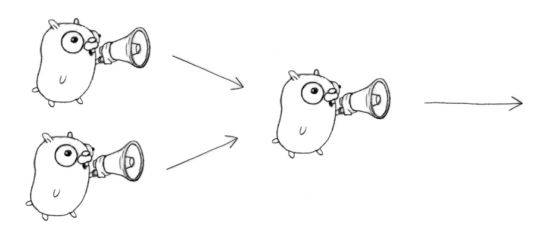

#Goroutine + Channel 实践


##背景
在最近开发的项目中，后端需要编写许多提供HTTP接口的API，另外技术选型相对宽松，因此选择Golang + Beego框架进行开发。之所以选择Golang，主要是考虑到开发的模块，都需要接受瞬时大并发、请求需要经历多个步骤、处理时间较长、无法同步立即返回结果的场景，Golang的goroutine以及channel所提供的语言层级的特性，正好可以满足这方面的需要。

goroutine不同于thread，threads是操作系统中的对于一个独立运行实例的描述，不同操作系统，对于thread的实现也不尽相同；但是，操作系统并不知道goroutine的存在，goroutine的调度是有Golang运行时进行管理的。启动thread虽然比process所需的资源要少，但是多个thread之间的上下文切换仍然是需要大量的工作的（寄存器/Program Count/Stack Pointer/...），Golang有自己的调度器，许多goroutine的数据都是共享的，因此goroutine之间的切换会快很多，启动goroutine所耗费的资源也很少，一个Golang程序同时存在几百个goroutine是很正常的。

channel，即“管道”，是用来传递数据（叫消息更为合适）的一个数据结构，即可以从channel里面塞数据，也可以从中获取数据。channel本身并没有什么神奇的地方，但是channel加上了goroutine，就形成了一种既简单又强大的请求处理模型，即N个工作goroutine将处理的中间结果或者最终结果放入一个channel，另外有M个工作goroutine从这个channel拿数据，再进行进一步加工，通过组合这种过程，从而胜任各种复杂的业务模型。

##模型
自己在实践的过程中，产生了几种通过goroutine + channel实现的工作模型，本文分别对这些模型进行

##V0.1: go关键字
直接加上go关键字，就可以让一个函数脱离原先的主函数独立运行，即主函数直接继续进行剩下的操作，而不需要等待某个十分耗时的操作完成。比如我们在写一个服务模块，接收到前端请求之后，然后去做一个比较耗时的任务。比如下面这个：

```
func (m *SomeController) PorcessSomeTask() {
    var task models.Task
    if err := task.Parse(m.Ctx.Request); err != nil {
        m.Data["json"] = err 
        m.ServeJson()
        return
    }
    task.Process()
    m.ServeJson()  
```
    
如果Process函数需要耗费大量时间的话，这个请求就会被block住。有时候，前端只需要发出一个请求给后端，并且不需要后端立即所处响应。遇到这样的需求，直接在耗时的函数前面加上go关键字就可以将请求之间返回给前端了，保证了体验。 

```
func (m *SomeController) PorcessSomeTask() {
    var task models.Task
    if err := task.Parse(m.Ctx.Request); err != nil {
        m.Data["json"] = err 
        m.ServeJson()
        return
    }
    go task.Process()
    m.ServeJson()    
    
 ```
   
不过，这种做法也是有许多限制的。比如：

只能在前端不需要立即得到后端处理的结果的情况下
这种请求的频率不应该很大，因为目前的做法没有控制并发

##V0.2: 并发控制

上一个方案有一个缺点就是无法控制并发，如果这一类请求同一个时间段有很多的话，每一个请求都启动一个goroutine，如果每个goroutine中还需要使用其他系统资源，消耗将是不可控的。

遇到这种情况，一个解决方案是：将请求都转发给一个channel，然后初始化多个goroutine读取这个channel中的内容，并进行处理。假设我们可以新建一个全局的channel

```
var TASK_CHANNEL = make(chan models.Task)

```

然后，启动多个goroutine：

```
for i := 0; i < WORKER_NUM; i ++ {
    go func() {
        for {
            select {
            case task := <- TASK_CHANNEL:
                task.Process()
            }
        }
    } ()
}

```

服务端接收到请求之后，将任务传入channel中即可：

```
func (m *SomeController) PorcessSomeTask() {
    var task models.Task
    if err := task.Parse(m.Ctx.Request); err != nil {
        m.Data["json"] = err 
        m.ServeJson()
        return
    }
    //go task.Process()
    TASK_CHANNEL <- task
    m.ServeJson()
}

```

这样一来，这个操作的并发度就可以通过WORKER_NUM来控制了。

##V0.3: 处理channel满的情况

不过，上面方案有一个bug：那就是channel初始化时是没有设置长度的，因此当所有WORKER_NUM个goroutine都正在处理请求时，再有请求过来的话，仍然会出现被block的情况，而且会比没有经过优化的方案还要慢（因为需要等某一个goroutine结束时才能处理它）。因此，需要在channel初始化时增加一个长度：

```
var TASK_CHANNEL = make(chan models.Task, TASK_CHANNEL_LEN)

```

这样一来，我们将TASK_CHANNEL_LEN设置得足够大，请求就可以同时接收TASK_CHANNEL_LEN个请求而不用担心被block。不过，这其实还是有问题的：那如果真的同时有大于TASK_CHANNEL_LEN个请求过来呢？一方面，这就应该算是架构方面的问题了，可以通过对模块进行扩容等操作进行解决。另一方面，模块本身也要考虑如何进行“优雅降级了”。遇到这种情况，我们应该希望模块能够及时告知调用方，“我已经达到处理极限了，无法给你处理请求了”。其实，这种需求，可以很简单的在Golang中实现：如果channel发送以及接收操作在select语句中执行并且发生阻塞，default语句就会立即执行。

```
select {
case TASK_CHANNEL <- task:
    //do nothing
default:
    //warnning!
    return fmt.Errorf("TASK_CHANNEL is full!")
}
//...

```

##V0.4: 接收发送给channel之后返回的结果

如果处理程序比较复杂的时候，通常都会出现在一个goroutine中，还会发送一些中间处理的结果发送给其他goroutine去做，经过多道“工序”才能最终将结果产出。

那么，我们既需要把某一个中间结果发送给某个channel，也要能获取到处理这次请求的结果。解决的方法是：将一个channel实例包含在请求中，goroutine处理完成后将结果写回这个channel。  

```
type TaskResponse struct {
    //...
}

type Task struct {
    TaskParameter   SomeStruct
    ResChan         *chan TaskResponse
}

//...

task := Task {
    TaskParameter   : xxx,
    ResChan         : make(chan TaskResponse),
}

TASK_CHANNEL <- task
res := <- task.ResChan
//...

```

（这边可能会有疑问：为什么不把一个复杂的任务都放在一个goroutine中依次的执行呢？是因为这里需要考虑到不同子任务，所消耗的系统资源不尽相同，有些是CPU集中的，有些是IO集中的，所以需要对这些子任务设置不同的并发数，因此需要经由不同的channel + goroutine去完成。）

##V0.5: 等待一组goroutine的返回


将任务经过分组，交由不同的goroutine进行处理，最终再将每个goroutine处理的结果进行合并，这个是比较常见的处理流程。这里需要用到WaitGroup来对一组goroutine进行同步。一般的处理流程如下：

```
var wg sync.WaitGroup
for i := 0; i < someLen; i ++ {
    wg.Add(1)
    go func(t Task) {
        defer wg.Done()
        //对某一段子任务进行处理
    } (tasks[i])
}

wg.Wait()
//处理剩下的工作

```

##V0.6: 超时机制
即使是复杂、耗时的任务，也必须设置超时时间。一方面可能是业务对此有时限要求（用户必须在XX分钟内看到结果），另一方面模块本身也不能都消耗在一直无法结束的任务上，使得其他请求无法得到正常处理。因此，也需要对处理流程增加超时机制。

我一般设置超时的方案是：和之前提到的“接收发送给channel之后返回的结果”结合起来，在等待返回channel的外层添加select，并在其中通过time.After()来判断超时。

```
task := Task {
    TaskParameter   : xxx,
    ResChan         : make(chan TaskResponse),
}

select {
case res := <- task.ResChan:
    //...
case <- time.After(PROCESS_MAX_TIME):
    //处理超时
}

```

##V0.7: 广播机制

既然有了超时机制，那也需要一种机制来告知其他goroutine结束手上正在做的事情并退出。很明显，还是需要利用channel来进行交流，第一个想到的肯定就是向某一个chan发送一个struct即可。比如执行任务的goroutine在参数中，增加一个chan struct{}类型的参数，当接收到该channel的消息时，就退出任务。但是，还需要解决两个问题：

怎样能在执行任务的同时去接收这个消息呢？
如何通知所有的goroutine？
对于第一个问题，比较优雅的作法是：使用另外一个channel作为函数d输出，再加上select，就可以一边输出结果，一边接收退出信号了。

另一方面，对于同时有未知数目个执行goroutine的情况，一次次调用done <-struct{}{}，显然无法实现。这时候，就会用到golang对于channel的tricky用法：当关闭一个channel时，所有因为接收该channel而阻塞的语句会立即返回。示例代码如下：

```
// 执行方
func doTask(done <-chan struct{}, tasks <-chan Task) (chan Result) {
    out := make(chan Result)
    go func() {
        // close 是为了让调用方的range能够正常退出
        defer close(out)
        for t := range tasks {
            select {
            case result <-f(task):
            case <-done:
                return
            }
        }
    }()

    return out
}

// 调用方
func Process(tasks <-chan Task, num int) {
    done := make(chan struct{})
    out := doTask(done, tasks)

    go func() {
        <- time.After(MAX_TIME)
        //done <-struct{}{}

        //通知所有的执行goroutine退出
        close(done)
    }()

    // 因为goroutine执行完毕，或者超时，导致out被close，range退出
    for res := range out {
        fmt.Println(res)
        //...
    }
}
```